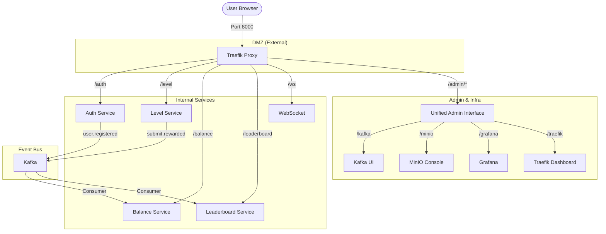

# TypeCat — Project Overview

A robust typing practice and competitive platform built with a high-performance microservices architecture. Users can register, practice through thematic levels, earn credits based on accuracy and speed, and compete on a global daily leaderboard.

---

## 🏗️ High-Level Architecture

The system is designed with a **Security-First DMZ** approach. Only the Traefik proxy is exposed to the internet, while all microservices and data stores reside in an isolated internal network.



---

## 🛠️ Microservices at a Glance

| Service | Responsibility | Database | Kafka Role |
| :--- | :--- | :--- | :--- |
| **`auth_service`** | Identity, registration, and JWT issuance. | PostgreSQL | Producer |
| **`level_service`** | Game content, thematic levels, and score calculation. | PostgreSQL | Producer |
| **`balance_service`** | User wallet management and transaction history. | PostgreSQL | Consumer |
| **`leaderboard_service`**| Real-time global daily rankings with WS updates. | Redis | Consumer |

---

## 🔑 Unified Administrative Interface

Infrastructure tools stay under `/admin/*`, while each Django service admin lives under `/service/admin/` for easier discovery.

- **Infrastructure Tools**:
  - `http://localhost:8000/admin/traefik/`: Runtime routing stats & health.
  - `http://localhost:8000/admin/kafka/`: Topic inspection & consumer monitoring.
  - `http://localhost:8000/admin/minio/`: Object storage & asset management.
  - `http://localhost:8000/admin/grafana/`: Rich observability & dashboards.
  - `http://localhost:8000/admin/docker/`: Lightweight container management.
- **Service Admins (Django)**:
  - `http://localhost:8000/auth/admin/`: User & Profile management.
  - `http://localhost:8000/level/admin/`: Level content & seed management.
  - `http://localhost:8000/balance/admin/`: Wallet & Transaction auditing.
  - `http://localhost:8000/leaderboard/admin/`: Leaderboard state inspection.

---

## 📡 API Reference

Categorized by service and access requirements. All routes are prefixed via Traefik.

### Auth & Identity (`/auth`)
- `POST /auth/registration`: Create a new account.
- `POST /auth/login`: Exchange credentials for JWT.
- `POST /auth/refresh`: Refresh expired access tokens.
- `GET /auth/users/{user_id}`: **[JWT Required]** Retrieve user profile.

### Typing & Levels (`/level`)
- `GET /level/`: **[JWT Required]** List available levels.
- `GET /level/{uuid}/`: **[JWT Required]** Retrieve specific level content.
- `POST /level/`: **[JWT Required]** Submit level results for reward calculation.

### Economy (`/balance` & `/transactions`)
- `GET /balance/{user_id}`: **[JWT Required]** Check current credit balance.
- `GET /transactions/{user_id}`: **[JWT Required]** View full credit history.

### Social (`/leaderboard`)
- `GET /leaderboard/`: **[JWT Required]** Fetch current top players.
- `WS /ws`: Real-time leaderboard updates via WebSocket.

---

## ⚡ Event-Driven Architecture

The system utilizes an asynchronous event-driven design to ensure high availability and scalability.

### Core Events
1. **`user.registered`**: Published by `auth_service` when a new account is created.
   - **Consumer**: `balance_service` immediately initializes a wallet with zero balance.
2. **`submit.rewarded`**: Published by `level_service` when a user completes a level.
   - **Consumer**: `balance_service` adds credits to the user's wallet.
   - **Consumer**: `leaderboard_service` updates the global ranking.

### Event Schema: `submit.rewarded`
```json
{
  "event": "submit.rewarded",
  "event_id": "6ba7b810-9dad-11d1-80b4-00c04fd430c8",
  "user_id": "550e8400-e29b-41d4-a716-446655440000",
  "username": "alice",
  "amount": 80
}
```

---

## 📊 Observability Stack

A full-spectrum monitoring suite ensures the system remains healthy and performant.

- **Metrics**: **Prometheus** scrapes metrics from all services via `django-prometheus`.
- **Logs**: **Loki & Promtail** aggregate logs from all containers.
- **Traces**: **Tempo** provides distributed request tracing.
- **Visualization**: **Grafana** provides a unified dashboard for all the above.
- **Exporters**: Dedicated exporters for PostgreSQL, Redis, and Kafka.

---

## 💻 Development Workflow

### Project Structure
- `compose/`: Modular Docker Compose fragments.
- `traefik/`: Static and dynamic proxy configuration.
- `monitoring/`: Configuration for metrics and logging tools.
- `scripts/`: Initialization and helper scripts.

### Adding a New Service
1. Initialize a new Django service using the DDD pattern (`src/domain`, `src/application`, etc.).
2. Add a new `.yml` fragment in the `compose/` directory or update `compose/services.yml`.
3. Inform Traefik of the new service entry point via labels.
4. If the service requires auth, include the `auth-verify@file` middleware.
5. Use `KafkaEventConsumer` or `SubmitEventProducer` patterns for event integration.

---

## 🚀 Getting Started

1. **Deploy Stack**: `docker compose up -d`
2. **Apply Migrations**: `docker compose exec {service} python manage.py migrate`
3. **Verify Health**: Check the unified admin interface at `http://localhost:8000/admin/traefik/`.